# Solara - Sol & Sustentabilidade

<div align="center">

A modern, minimalist web application built with Next.js 16 that monitors real-time climate data, air quality, and luminosity with dynamic themes that adapt to time of day and weather conditions.

[](https://nextjs.org/)
[](https://react.dev/)
[](https://www.typescriptlang.org/)
[](https://tailwindcss.com/)
[](LICENSE)

[🌐 Live Demo](https://solara.vercel.app) • [📖 Documentation](#table-of-contents) • [🐛 Report Bug](https://github.com/DanielSantos08/solara/issues) • [✨ Request Feature](https://github.com/DanielSantos08/solara/issues)

</div>

## Table of Contents

- [Features](#features)
- [Screenshots](#screenshots)
  - [Animated Weather Icons](#animated-weather-icons)
- [Technology Stack](#technology-stack)
- [Project Structure](#project-structure)
- [Getting Started](#getting-started)
- [Environment Variables](#environment-variables)
- [API Integration](#api-integration)
- [Dynamic Theme System](#dynamic-theme-system)
- [Internationalization](#internationalization)
- [Components](#components)
- [Development](#development)
  - [Creating Animated GIF Icons](#creating-animated-gif-icons)
- [Build & Deployment](#build--deployment)
- [License](#license)
- [Contributing](#contributing)
- [Author](#author)

## Features

### Core Functionality

- **Real-time Weather Data**: Temperature, humidity, wind speed, atmospheric pressure, visibility, precipitation
- **Air Quality Monitoring**: PM2.5 and PM10 measurements via OpenWeatherMap Air Pollution API
- **Estimated Luminosity**: Intelligent calculation based on time of day, cloud coverage, and weather conditions
- **Moon Phase Tracking**: Astronomical calculation with 8 distinct phases displayed with native emojis
- **Timezone-aware Clock**: Live clock showing the selected city's local time with seconds precision

### User Experience

- **Dynamic Themes**: Interface automatically adapts based on local time (morning, day, golden hour, night)
- **Geolocation Support**: Automatic location detection or manual city search
- **Interactive Charts**: Luminosity visualization throughout the day using Chart.js
- **Responsive Design**: Optimized for desktop, tablet, and mobile devices
- **Custom Weather Icons**: SVG-based animated icons that reflect current conditions
- **Real-time Updates**: Clock updates every second, data refreshes every 5 minutes

### Technical Highlights

- **Next.js 16**: Leveraging App Router, Server Components, and Turbopack
- **Internationalization**: Full i18n support with English and Portuguese translations
- **Type Safety**: Full TypeScript implementation with strict type checking
- **Performance**: Server-side caching, optimized API calls, minimal client-side JavaScript
- **Security**: API keys protected on server-side, no client exposure
- **Accessibility**: Semantic HTML, ARIA labels, keyboard navigation support

## Screenshots

### Full Application Views

| Day Theme | Golden Hour Theme | Night Theme |
|-----------|-------------------|-------------|
| 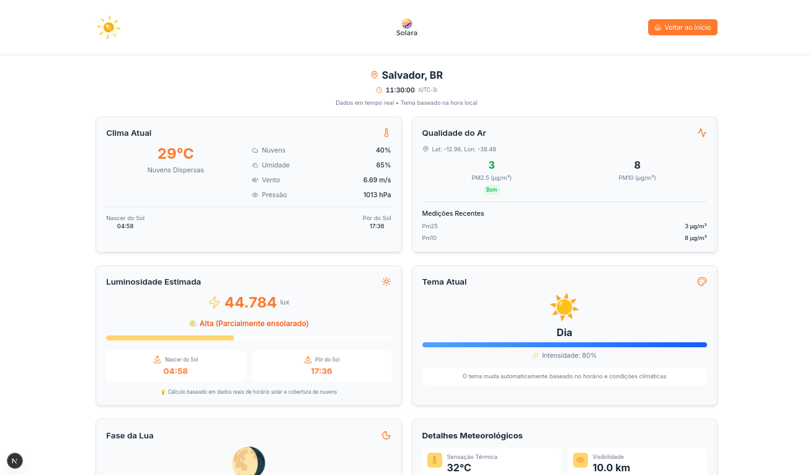 | 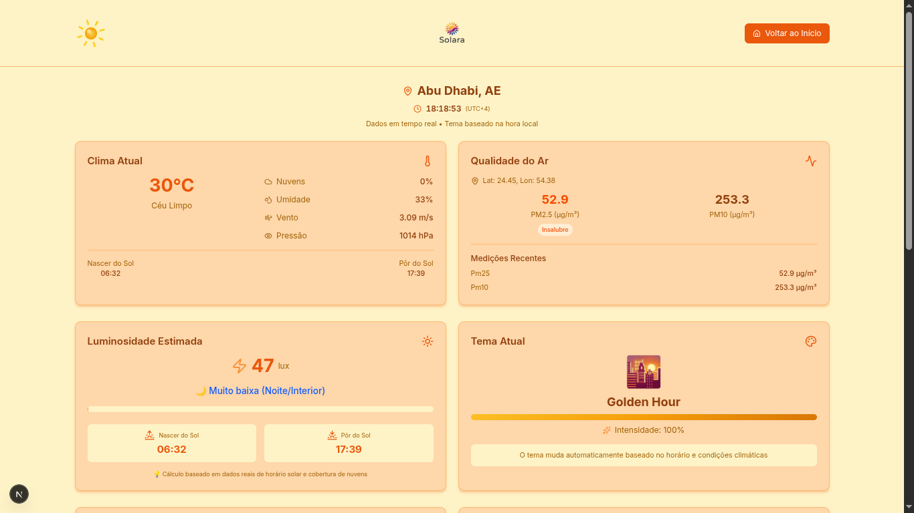 |  |

### Component Showcase

#### Weather & Environment Cards

| Current Weather | Air Quality | Estimated Luminosity |
|----------------|-------------|---------------------|
| 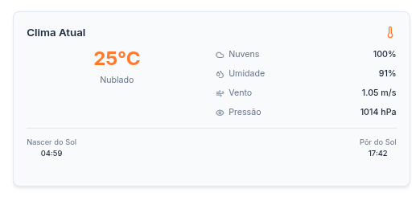 | 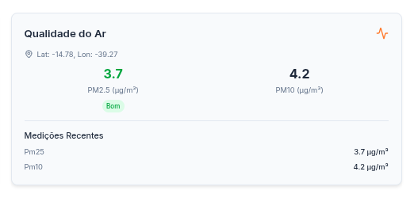 | 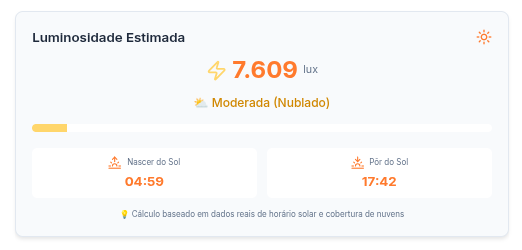 |

#### Additional Information Cards

| Moon Phase | Meteorological Details | Luminosity Chart |
|-----------|----------------------|------------------|
| 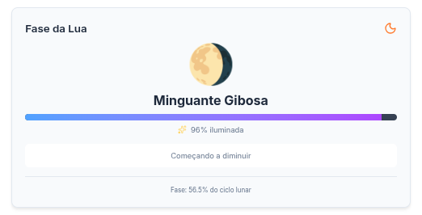 | 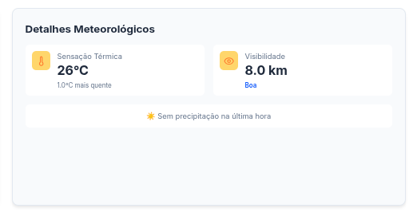 | 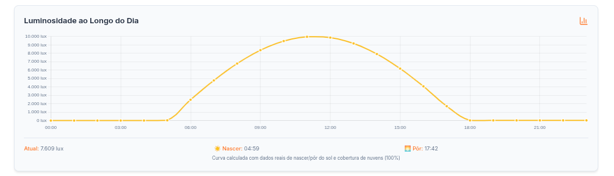 |

#### Theme Cards

| Day Theme | Golden Hour Theme | Night Theme |
|-----------|-------------------|-------------|
| 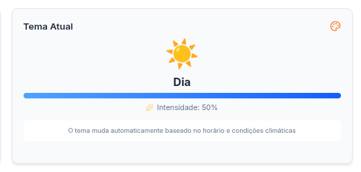 | 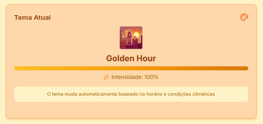 | 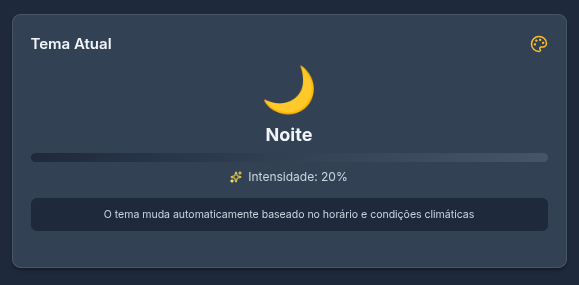 |

#### Animated Weather Icons

Our weather icons feature smooth CSS animations that bring the interface to life:

| ☀️ Sun | ☁️ Cloud | 🌧️ Rain | ⛈️ Thunder | 🌨️ Snow |
|--------|----------|---------|------------|----------|
| 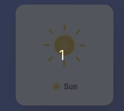 | 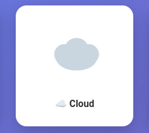 | 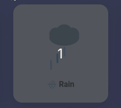 | 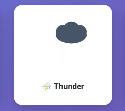 | 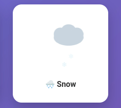 |
| Rotating rays | Drifting motion | Falling drops | Flashing lightning | Falling snowflakes |

**Moon Phases with Glow Effect:**

| 🌑 New Moon | 🌓 First Quarter | 🌕 Full Moon |
|-------------|------------------|--------------|
| 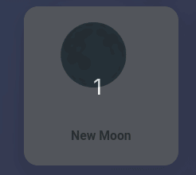 | 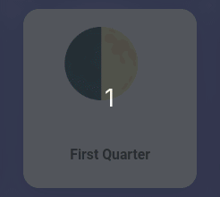 | 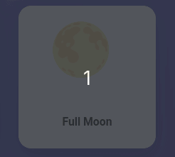 |
| Subtle glow pulse | Side glow pulse | Full glow with aura |

> **Want to create your own?** Check out our [Weather Icons Demo Page](public/weather-icons-demo.html) and follow the [GIF Generation Guide](GENERATING_GIFS.md)!

## Technology Stack

### Frontend

- **Next.js 16.0.1**: React framework with App Router and Server Components
- **React 19.2.0**: UI library with latest features
- **TypeScript 5.x**: Static type checking
- **Tailwind CSS 4.x**: Utility-first CSS framework
- **Chart.js 4.5.1**: Data visualization library
- **Lucide React 0.548.0**: Icon library
- **next-intl**: Internationalization library for Next.js

### Backend & APIs

- **Next.js API Routes**: Server-side API endpoints
- **OpenWeatherMap API**: Weather data and air quality
  - Current Weather API
  - Air Pollution API
  - Geocoding API

### Development Tools

- **ESLint 9.38.0**: Code linting
- **Prettier 3.6.2**: Code formatting
- **Turbopack**: Next.js 16 default bundler
- **React Compiler**: Babel plugin for React optimization

## Project Structure

```
solara/
├── public/
│   ├── components_readme/       # Component screenshots
│   ├── logo-solara.png          # Main logo
│   └── logo-theme-black.png     # Night theme logo
├── src/
│   ├── app/
│   │   ├── api/
│   │   │   ├── dashboard/       # Main data API route
│   │   │   └── geocode/         # City search API route
│   │   ├── globals.css          # Global styles & theme variables
│   │   ├── layout.tsx           # Root layout
│   │   └── page.tsx             # Home page
│   ├── components/
│   │   ├── AQICard.tsx          # Air quality card
│   │   ├── Dashboard.tsx        # Main dashboard layout
│   │   ├── Footer.tsx           # Footer component
│   │   ├── Header.tsx           # Header with logo & navigation
│   │   ├── LocationSelector.tsx # Geolocation & city search
│   │   ├── LuxCard.tsx          # Luminosity information card
│   │   ├── LuxChart.tsx         # Luminosity chart
│   │   ├── MoonCard.tsx         # Moon phase card
│   │   ├── ThemeCard.tsx        # Current theme card
│   │   ├── ThemeProvider.tsx    # Theme context provider
│   │   ├── WeatherCard.tsx      # Weather information card
│   │   ├── WeatherDetailsCard.tsx # Additional weather details
│   │   └── WeatherIcon.tsx      # Custom SVG weather icons
│   ├── i18n/
│   │   ├── locales/
│   │   │   ├── en.json          # English translations
│   │   │   └── pt.json          # Portuguese translations
│   │   └── request.ts           # i18n configuration
│   ├── types/
│   │   └── index.ts             # TypeScript type definitions
│   └── utils/
│       ├── moon.ts              # Moon phase calculations
│       └── timezone.ts          # Timezone utilities
├── .env                         # Environment variables (not in repo - ignored by Git)
├── env.example                  # Environment variables template (committed to repo)
├── next.config.ts               # Next.js configuration
├── package.json                 # Dependencies
├── tailwind.config.ts           # Tailwind configuration
└── tsconfig.json                # TypeScript configuration
```

## Getting Started

### Prerequisites

- Node.js 20.9 or higher
- npm, yarn, or pnpm package manager
- OpenWeatherMap API key (free tier available)

### Installation

1. Clone the repository:
```bash
git clone https://github.com/yourusername/solara.git
cd solara
```

2. Install dependencies:
```bash
npm install
# or
yarn install
# or
pnpm install
```

3. Create environment file:
```bash
cp env.example .env
```

4. Add your OpenWeatherMap API key to `.env`:
```env
OPENWEATHER_KEY=your_api_key_here
```

**Note**: The `.env` file is ignored by Git (listed in `.gitignore`) to protect your API key. Never commit this file to version control.

5. Run the development server:
```bash
npm run dev
# or
yarn dev
# or
pnpm dev
```

6. Open [http://localhost:3000](http://localhost:3000) in your browser.

### Obtaining an API Key

1. Visit [OpenWeatherMap](https://openweathermap.org/api)
2. Sign up for a free account
3. Navigate to API Keys section
4. Generate a new API key
5. Copy the key to your `.env` file

Note: Free tier includes 1,000 API calls per day, sufficient for development and personal use.

## Environment Variables

The application uses environment variables for configuration and security.

### File Structure

- **`.env`** - Contains your actual API keys and secrets (ignored by Git)
- **`env.example`** - Template file with example values (committed to repo)

### Required Variables

```env
# Server-side only - Never exposed to client
OPENWEATHER_KEY=your_openweathermap_api_key
```

### Setup Instructions

1. Copy the example file:
   ```bash
   cp env.example .env
   ```

2. Add your actual API key to `.env`

3. The `.env` file is automatically ignored by Git (listed in `.gitignore`)

**Security Note**: The API key is only used in server-side API routes (`/api/dashboard` and `/api/geocode`), ensuring it's never exposed to the client browser. Never commit your `.env` file to version control.

## API Integration

### OpenWeatherMap APIs

The application integrates three OpenWeatherMap endpoints:

#### 1. Current Weather API
- **Endpoint**: `/data/2.5/weather`
- **Data**: Temperature, humidity, wind, pressure, clouds, precipitation
- **Includes**: Timezone offset for accurate local time calculation

#### 2. Air Pollution API
- **Endpoint**: `/data/2.5/air_pollution`
- **Data**: PM2.5, PM10 concentrations
- **Unit**: μg/m³ (micrograms per cubic meter)

#### 3. Geocoding API
- **Endpoint**: `/geo/1.0/direct`
- **Purpose**: Convert city names to coordinates
- **Protected**: Server-side proxy to hide API key

### Internal API Routes

#### `/api/dashboard`
Main data endpoint that aggregates:
- Weather data
- Air quality data
- Calculated luminosity
- Theme determination
- Moon phase calculation
- Timezone-aware timestamps

**Caching**: 5-minute server-side cache to optimize API usage

#### `/api/geocode`
City search endpoint:
- Accepts city name query
- Returns coordinates and location data
- Protects API key on server-side

## Dynamic Theme System

The application features four distinct themes that automatically switch based on the selected city's local time:

### Morning Theme (5:00 - 8:00)
- **Colors**: Soft orange and yellow tones
- **Atmosphere**: Warm sunrise ambiance
- **Intensity**: Based on cloud coverage

### Day Theme (8:00 - 17:00)
- **Colors**: Blue and white tones
- **Atmosphere**: Bright and clear
- **Intensity**: Maximum during midday

### Golden Hour Theme (17:00 - 19:00)
- **Colors**: Golden and orange gradient
- **Atmosphere**: Sunset warmth
- **Intensity**: High with special effects

### Night Theme (19:00 - 5:00)
- **Colors**: Dark blue and purple tones
- **Atmosphere**: Calm and serene
- **Intensity**: Low, moon-based lighting
- **Special**: Black logo variant for contrast

### Theme Implementation

Themes are implemented using CSS custom properties in `globals.css`:

```css
[data-theme="morning"] {
  --theme-bg-primary: #fff7ed;
  --theme-accent: #f59e0b;
  /* ... */
}
```

Applied dynamically via `ThemeProvider` context and `data-theme` attribute on the document root.

## Internationalization

The application supports multiple languages using next-intl library.

### Supported Languages

- **Portuguese (pt)**: Default language
- **English (en)**: Full translation available

### Language Switching

Users can switch languages using the language selector in the header:
- Dropdown menu with language options
- Selection persists via cookies
- Automatic page reload to apply new language

### Translation Files

Translation files are located in `src/i18n/locales/`:

```
src/i18n/
├── locales/
│   ├── en.json    # English translations
│   └── pt.json    # Portuguese translations
└── request.ts     # i18n configuration
```

### Adding New Languages

1. Create a new JSON file in `src/i18n/locales/` (e.g., `es.json`)
2. Copy the structure from `en.json` or `pt.json`
3. Translate all strings
4. Add the locale to `src/i18n/request.ts`:

```typescript
export const locales = ['en', 'pt', 'es'] as const;
```

5. Add the language option to `LanguageSelector.tsx`:

```tsx
<option value="es">Español</option>
```

### Translation Keys

All user-facing text is organized by component/feature:

- `common`: Shared text (buttons, labels)
- `header`: Header component
- `locationSelector`: Location selection interface
- `dashboard`: Dashboard layout
- `weatherCard`: Weather information card
- `aqiCard`: Air quality card
- `luxCard`: Luminosity card
- `themeCard`: Theme information card
- `moonCard`: Moon phase card
- `weatherDetailsCard`: Detailed weather information
- `footer`: Footer component
- `page`: Main page content

### Usage in Components

```tsx
import { useTranslations } from 'next-intl';

function MyComponent() {
  const t = useTranslations('componentName');

  return <h1>{t('title')}</h1>;
}
```

## Components

### Core Components

#### Header
- Dynamic logo (changes color for night theme)
- Animated weather icon reflecting current conditions
- "Back to Start" button (visible only when data is loaded)
- Responsive layout

#### Dashboard
- Grid layout with responsive columns
- Real-time clock with timezone display
- City name and country
- Organized card sections

#### LocationSelector
- Geolocation button with browser API integration
- Manual city search with autocomplete
- Error handling and loading states

### Data Display Components

#### WeatherCard
- Current temperature and "feels like"
- Weather description
- Humidity, wind speed, pressure
- Sunrise and sunset times (timezone-aware)

#### AQICard
- PM2.5 and PM10 levels
- Color-coded quality indicators
- Health recommendations
- Last updated timestamp

#### LuxCard
- Estimated luminosity in lux
- Sunrise and sunset times
- Descriptive intensity levels
- Icon-based visualization

#### MoonCard
- Current moon phase (8 phases)
- Phase name in Portuguese
- Emoji representation
- Illumination percentage

#### WeatherDetailsCard
- Visibility distance
- Precipitation (rain/snow)
- Additional meteorological data

#### ThemeCard
- Current active theme
- Theme description
- Intensity percentage
- Visual representation

#### LuxChart
- Line chart showing luminosity throughout the day
- Sunrise and sunset markers
- Real-time data point highlighting
- Responsive canvas

### Utility Components

#### WeatherIcon
Custom SVG icons with animations:
- Sun with radial gradient and rotating rays
- Clouds with multiple density levels
- Rain with falling droplets
- Snow with detailed flakes
- Lightning with glow effects
- Fog with gradient layers
- Moon with phase-accurate emoji
- Combined conditions (e.g., moon + clouds)

#### ThemeProvider
- React Context for theme state
- Automatic theme application
- Document attribute management

## Development

### Code Quality

The project enforces code quality through:

- **ESLint**: Configured with Next.js and TypeScript rules
- **Prettier**: Consistent code formatting
- **TypeScript**: Strict type checking enabled
- **Git Hooks**: Pre-commit linting (optional)

### Scripts

```bash
# Development server with hot reload
npm run dev

# Production build
npm run build

# Start production server
npm run start

# Lint code
npm run lint
```

### Creating Animated GIF Icons

Want to create your own animated weather icon GIFs? We've made it easy!

#### Quick Start (3 Steps)

1. **Start the development server:**
   ```bash
   npm run dev
   ```

2. **Open the demo page:**
   Navigate to: `http://localhost:3000/weather-icons-demo.html`

3. **Record GIFs using a screen recorder:**
   - **Windows:** [ScreenToGif](https://www.screentogif.com/) (Free)
   - **macOS:** [Gifox](https://gifox.app/) or [Kap](https://getkap.co/) (Free)
   - **Linux:** Peek - `sudo apt install peek` (Free)

#### Recommended Settings

- **Size:** 200x200px or 300x300px
- **FPS:** 30 fps
- **Duration:** 3-5 seconds
- **Loop:** Infinite
- **Quality:** High

#### What You'll Get

The demo page includes all animated icons:
- ☀️ Sun with rotating rays
- ☁️ Cloud with drifting motion
- 🌧️ Rain with falling drops
- ⛈️ Thunder with flashing lightning
- 🌨️ Snow with falling snowflakes
- 🌑🌓🌕 Moon phases with glow effects

**Full Guide:** See [GENERATING_GIFS.md](GENERATING_GIFS.md) for detailed instructions and advanced options.

### Type Definitions

All types are centralized in `src/types/index.ts`:

```typescript
interface WeatherData {
  temp: number;
  feelsLike: number;
  description: string;
  // ...
}

interface DashboardData {
  weather: WeatherData;
  aqi: AQIData;
  estimatedLux: number;
  theme: ThemeData;
  moon: MoonData;
  location: LocationData;
}
```

## Build & Deployment

### Production Build

```bash
npm run build
```

This creates an optimized production build in the `.next` directory.

### Deployment Options

#### Vercel (Recommended)
1. Push code to GitHub
2. Import project in Vercel dashboard
3. Add `OPENWEATHER_KEY` environment variable
4. Deploy automatically

#### Other Platforms
The application can be deployed to any platform supporting Next.js:
- Netlify
- AWS Amplify
- Google Cloud Run
- Docker containers

### Environment Variables in Production

Ensure `OPENWEATHER_KEY` is set in your deployment platform's environment variables section.

## License

This project is licensed under the MIT License. See [LICENSE](LICENSE) file for details.

## Contributing

Contributions are welcome! Please feel free to submit a Pull Request.

1. Fork the project
2. Create your feature branch (`git checkout -b feature/AmazingFeature`)
3. Commit your changes (`git commit -m 'Add some AmazingFeature'`)
4. Push to the branch (`git push origin feature/AmazingFeature`)
5. Open a Pull Request

## Author

**Daniel Santos**
- GitHub: [@DanielSantos08](https://github.com/DanielSantos08)
- Repository: [solara](https://github.com/DanielSantos08/solara)

---

<div align="center">

**Built with ☀️ using Next.js 16 and powered by OpenWeatherMap API**

⭐ Star this repository if you find it helpful!

</div>

